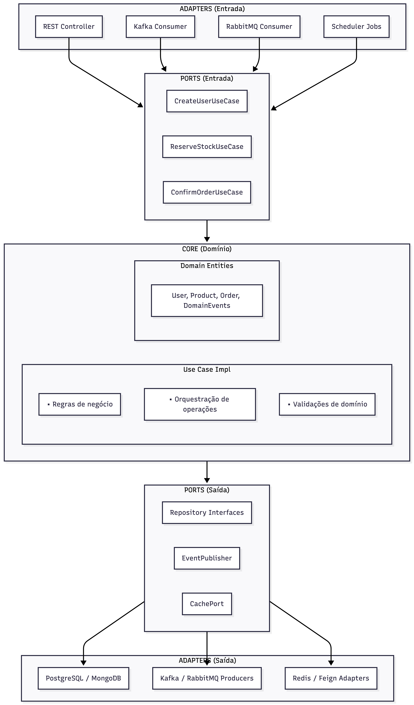

# Cactus - Kotlin Hexagonal Boilerplate

Um boilerplate para aplicações Kotlin com Spring Boot, seguindo os princípios da **Arquitetura Hexagonal (Ports and Adapters)**. 
Este projeto demonstra CRUD completo de Usuários, Produtos/Estoque e Pedidos, utilizando toda a infraestrutura moderna disponível.

## Índice

1. [Arquitetura Hexagonal](#arquitetura-hexagonal)
2. [Tecnologias](#tecnologias)
3. [Estrutura do Projeto](#estrutura-do-projeto)
4. [Conceitos e Padrões](#conceitos-e-padrões)
5. [Como Executar](#como-executar)
6. [API Reference](#api-reference)
7. [Configurações](#configurações)
8. [Guia de Desenvolvimento](#guia-de-desenvolvimento)

---

## Arquitetura Hexagonal

A Arquitetura Hexagonal (também conhecida como Ports and Adapters) isola a lógica de negócio das dependências externas, tornando o sistema mais testável, manutenível e flexível.

### Princípios Fundamentais



### Por que usar Arquitetura Hexagonal?

1. **Testabilidade**: Core pode ser testado sem infraestrutura real
2. **Flexibilidade**: Troque PostgreSQL por MongoDB sem mudar regras de negócio
3. **Manutenibilidade**: Mudanças em uma camada não afetam outras
4. **Clareza**: Separação clara de responsabilidades

## Tecnologias

| Categoria | Tecnologia | Versão |
|-----------|------------|--------|
| Linguagem | Kotlin | 2.1.0 |
| Runtime | Java | 23 |
| Framework | Spring Boot | 3.4.1 |
| Banco Relacional | PostgreSQL | 16 |
| Banco NoSQL | MongoDB | 7.0 |
| Cache | Redis + Lettuce | 7 |
| Lock Distribuído | Redisson | 3.40.2 |
| Mensageria | Apache Kafka | 3.6 |
| Mensageria | RabbitMQ | 3.13 |
| HTTP Client | OpenFeign | 4.2.0 |
| Scheduling | ShedLock | 5.16.0 |
| Observabilidade | OpenTelemetry | - |
| Tracing | Jaeger | 1.53 |
| Métricas | Prometheus + Grafana | - |
| API Docs | SpringDoc OpenAPI | 2.7 |
| Testes | JUnit 5, MockK, Testcontainers | - |
| Concorrência | Kotlin Coroutines | 1.9.0 |

---

## Estrutura do Projeto

```
src/main/kotlin/br/com/cactus/
├── Application.kt                           # Ponto de entrada da aplicação
│
├── core/                                    # NÚCLEO - Regras de negócio (ZERO dependências externas)
│   │
│   ├── domain/                              # Entidades de domínio
│   │   ├── User.kt                          # Usuário com validações
│   │   ├── Product.kt                       # Produto com gestão de estoque
│   │   ├── Order.kt                         # Pedido com máquina de estados
│   │   ├── Address.kt                       # Endereço (para integração CEP)
│   │   └── DomainEvent.kt                   # Eventos: UserCreated, StockUpdated, etc.
│   │
│   ├── ports/                               # Interfaces (contratos)
│   │   ├── input/                           # PORTS DE ENTRADA (Use Cases)
│   │   │   ├── UserUseCases.kt              # CreateUser, GetUser, UpdateUser, etc.
│   │   │   ├── ProductUseCases.kt           # CreateProduct, ReserveStock, etc.
│   │   │   └── OrderUseCases.kt             # CreateOrder, ConfirmOrder, etc.
│   │   │
│   │   └── output/                          # PORTS DE SAÍDA (Interfaces para infra)
│   │       ├── UserRepository.kt            # Interface de persistência de usuários
│   │       ├── ProductRepository.kt         # Interface de persistência de produtos
│   │       ├── OrderRepository.kt           # Interface de persistência de pedidos
│   │       ├── EventPublisher.kt            # Interface para publicar eventos
│   │       ├── CachePort.kt                 # Interface de cache
│   │       ├── DistributedLockPort.kt       # Interface de lock distribuído
│   │       └── AddressLookupPort.kt         # Interface para consulta de CEP
│   │
│   ├── usecase/                             # Implementações dos Use Cases
│   │   ├── UserUseCasesImpl.kt              # Lógica de negócio de usuários
│   │   ├── ProductUseCasesImpl.kt           # Lógica de negócio de produtos
│   │   └── OrderUseCasesImpl.kt             # Lógica de negócio de pedidos
│   │
│   ├── config/                              # Configurações e constantes do core
│   │   └── CoreConstants.kt                 # CacheKeys, CacheTtl, LockConfig, etc.
│   │
│   └── exception/                           # Exceções de domínio
│       └── DomainExceptions.kt              # EntityNotFound, InsufficientStock, etc.
│
├── adapter/                                 # 🔌 ADAPTADORES - Implementações concretas
│   │
│   ├── inbound/                             # Adaptadores de ENTRADA
│   │   │
│   │   ├── rest/                            # API REST
│   │   │   ├── controller/                  # Controllers (chamam Use Cases)
│   │   │   │   ├── UserController.kt
│   │   │   │   ├── ProductController.kt
│   │   │   │   ├── OrderController.kt
│   │   │   │   └── AddressController.kt     # Consulta de CEP
│   │   │   ├── dto/                         # Data Transfer Objects
│   │   │   │   ├── UserDtos.kt
│   │   │   │   ├── ProductDtos.kt
│   │   │   │   └── OrderDtos.kt
│   │   │   ├── mapper/                      # Mapeadores DTO <-> Domain
│   │   │   │   └── DtoMappers.kt
│   │   │   ├── interceptor/                 # Interceptors HTTP
│   │   │   │   └── UserValidationInterceptor.kt  # Valida X-User-Id header
│   │   │   └── exception/                   # Exception handlers
│   │   │       └── GlobalExceptionHandler.kt
│   │   │
│   │   ├── consumer/                        # Consumers de mensagens
│   │   │   ├── kafka/
│   │   │   │   └── DomainEventConsumer.kt   # Processa eventos Kafka
│   │   │   └── rabbitmq/
│   │   │       └── RabbitMQEventConsumer.kt # Processa eventos RabbitMQ
│   │   │
│   │   └── scheduler/                       # Jobs agendados
│   │       └── OrderExpirationScheduler.kt  # Cancela pedidos expirados (ShedLock)
│   │
│   └── outbound/                            # Adaptadores de SAÍDA
│       │
│       ├── persistence/                     # Persistência
│       │   ├── jpa/                         # PostgreSQL (JPA/Hibernate)
│       │   │   ├── entity/                  # Entidades JPA
│       │   │   │   ├── UserEntity.kt
│       │   │   │   └── OrderEntity.kt
│       │   │   ├── repository/              # Spring Data JPA Repositories
│       │   │   │   ├── JpaUserRepository.kt
│       │   │   │   └── JpaOrderRepository.kt
│       │   │   ├── mapper/                  # Mapeadores Entity <-> Domain
│       │   │   │   └── JpaMappers.kt
│       │   │   ├── UserRepositoryAdapter.kt # Implementa UserRepository port
│       │   │   └── OrderRepositoryAdapter.kt
│       │   │
│       │   └── mongodb/                     # MongoDB
│       │       ├── document/                # Documentos MongoDB
│       │       │   └── ProductDocument.kt
│       │       ├── repository/              # Spring Data MongoDB Repositories
│       │       │   └── MongoProductRepository.kt
│       │       ├── mapper/                  # Mapeadores Document <-> Domain
│       │       │   └── MongoMappers.kt
│       │       └── ProductRepositoryAdapter.kt
│       │
│       ├── messaging/                       # Mensageria
│       │   ├── kafka/
│       │   │   └── KafkaEventPublisherAdapter.kt
│       │   ├── rabbitmq/
│       │   │   └── RabbitMQEventPublisherAdapter.kt
│       │   └── CompositeEventPublisher.kt   # Publica em Kafka + RabbitMQ
│       │
│       ├── cache/                           # Cache e Lock Distribuído
│       │   ├── RedisCacheAdapter.kt         # Implementa CachePort
│       │   └── RedisDistributedLockAdapter.kt # Implementa DistributedLockPort
│       │
│       └── client/                          # Clientes HTTP externos
│           ├── BrasilApiFeignClient.kt      # Cliente Feign para Brasil API (CEP)
│           └── AddressLookupAdapter.kt      # Implementa AddressLookupPort
│
└── config/                                  # CONFIGURAÇÕES Spring
    ├── KafkaConfig.kt                       # Producer/Consumer Kafka
    ├── RabbitMQConfig.kt                    # Exchanges, Queues, Bindings
    ├── RedisConfig.kt                       # Lettuce, Pool, Cluster support
    ├── ShedLockConfig.kt                    # Distributed scheduling
    ├── FeignConfig.kt                       # HTTP clients externos
    ├── WebMvcConfig.kt                      # Interceptors, CORS
    ├── OpenTelemetryConfig.kt               # Tracing
    └── OpenApiConfig.kt                     # Swagger/OpenAPI
```

---

## Conceitos e Padrões

### 1. Ports (Interfaces)

**INPUT PORTS** são interfaces que definem o que a aplicação pode fazer:
```kotlin
interface CreateUserUseCase {
    suspend fun execute(command: CreateUserCommand): User
}
```

**OUTPUT PORTS** são interfaces que definem o que a aplicação precisa:
```kotlin
interface UserRepository {
    suspend fun save(user: User): User
    suspend fun findById(id: UUID): User?
}
```

### 2. Adapters (Implementações)

**INBOUND ADAPTERS** recebem requisições externas:
```kotlin
@RestController
class UserController(
    private val createUserUseCase: CreateUserUseCase  // Usa o PORT, não a impl
) {
    @PostMapping
    suspend fun create(@RequestBody request: CreateUserRequest) =
        createUserUseCase.execute(request.toCommand())
}
```

**OUTBOUND ADAPTERS** implementam os ports de saída:
```kotlin
@Component
class UserRepositoryAdapter(
    private val jpaRepository: JpaUserRepository
) : UserRepository {  // Implementa o PORT
    override suspend fun save(user: User) =
        jpaRepository.save(user.toEntity()).toDomain()
}
```

### 3. Interceptor (Validação de Usuário)

O `UserValidationInterceptor` valida o header `X-User-Id` nas rotas de Orders:

```kotlin
// Requisição para /api/v1/orders/* DEVE ter o header X-User-Id
curl -X POST http://localhost:8080/api/v1/orders \
  -H "X-User-Id: 550e8400-e29b-41d4-a716-446655440000" \
  -H "Content-Type: application/json" \
  -d '{"items": [...]}'
```

O interceptor:
1. Extrai o header `X-User-Id`
2. Valida formato UUID
3. Verifica se usuário existe (cache → database)
4. Armazena userId validado para uso no controller

### 4. ShedLock (Jobs Distribuídos)

Jobs agendados rodam em apenas UMA instância por vez:

```kotlin
@Scheduled(cron = "0 0 * * * *")  // A cada hora
@SchedulerLock(
    name = "order-expiration-check",
    lockAtMostFor = "PT30M",   // Máximo 30 minutos
    lockAtLeastFor = "PT5M"    // Mínimo 5 minutos
)
fun cancelExpiredPendingOrders() {
    // Só uma instância executa
}
```

### 5. Feign Client (API Externa)

Consulta de CEP via Brasil API:

```kotlin
@FeignClient(name = "brasil-api-cep", url = "\${feign.clients.brasil-api.url}")
interface BrasilApiFeignClient {
    @GetMapping("/cep/v2/{cep}")
    fun findByCep(@PathVariable cep: String): BrasilApiCepResponse
}
```

O adapter implementa o PORT do core:
```kotlin
@Component
class AddressLookupAdapter(
    private val brasilApiClient: BrasilApiFeignClient,
    private val cachePort: CachePort
) : AddressLookupPort {  // PORT definido no core
    override suspend fun findByCep(cep: String): Address? { ... }
}
```

### 6. Redis Cluster

Para produção com alta disponibilidade, use Redis Cluster:

```yaml
# application.yml
spring:
  profiles:
    active: redis-cluster
  data:
    redis:
      cluster:
        enabled: true
        nodes:
          - redis-node-1:6379
          - redis-node-2:6379
          - redis-node-3:6379
        max-redirects: 3
```

### 7. Padrões de Lock

| Padrão | Quando Usar | Exemplo |
|--------|-------------|---------|
| **Distributed Lock** | Recurso único, alta concorrência | Reserva de estoque |
| **Multi-Lock** | Múltiplos recursos atômicos | Confirmar pedido (N produtos) |
| **Optimistic Lock** | Conflitos raros, leitura frequente | Atualizar preço |
| **Pessimistic Lock** | Transações críticas | Mudar status do pedido |

### 8. Lock Otimista com Retry e Backoff Exponencial

Para cenários de concorrência moderada, utilizamos lock otimista com retry automático:

```kotlin
// Configuração do retry em CoreConstants.kt
object OptimisticLockConfig {
    const val MAX_RETRIES = 3
    val INITIAL_BACKOFF: Duration = 50.milliseconds
    val MAX_BACKOFF: Duration = 500.milliseconds
    const val BACKOFF_MULTIPLIER = 2.0
}
```

**Comportamento:**
1. Tenta atualização atômica com verificação de versão
2. Se falhar (versão diferente), faz log de warning
3. Aguarda tempo de backoff exponencial (50ms → 100ms → 200ms)
4. Repete até MAX_RETRIES ou sucesso
5. Lança `ConcurrencyException` se todas tentativas falharem

### 9. Constantes Centralizadas

Todas as strings hardcoded estão centralizadas em `core/config/CoreConstants.kt`:

- `CacheKeys`: Prefixos e funções para gerar chaves de cache
- `CacheTtl`: Tempos de expiração do cache
- `LockConfig`: Configurações de lock distribuído
- `OptimisticLockConfig`: Configurações de retry
- `SchedulerConfig`: Nomes e tempos de lock para jobs
- `HttpHeaders`: Headers HTTP customizados
- `StockUpdateReason`: Enum com razões de atualização de estoque

---

## Como Executar

### Pré-requisitos
- Java 23
- Maven 3.9+
- Docker e Docker Compose

### Docker Compose (Recomendado)

```bash
# Subir tudo
docker-compose up -d

# Ver logs da aplicação
docker-compose logs -f app

# Parar
docker-compose down

# Limpar dados
docker-compose down -v
```

### Desenvolvimento Local

```bash
# Subir apenas infraestrutura
docker-compose up -d postgres mongodb redis kafka zookeeper rabbitmq jaeger

# Rodar aplicação
mvn spring-boot:run
```

### Endpoints Disponíveis

| Serviço | URL |
|---------|-----|
| API | http://localhost:8080 |
| Swagger UI | http://localhost:8080/swagger-ui.html |
| Kafka UI | http://localhost:8090 |
| RabbitMQ | http://localhost:15672 (guest/guest) |
| Jaeger | http://localhost:16686 |
| Prometheus | http://localhost:9090 |
| Grafana | http://localhost:3000 (admin/admin) |

---

## API Reference

### Users (sem header obrigatório)

```bash
# Criar
curl -X POST http://localhost:8080/api/v1/users \
  -H "Content-Type: application/json" \
  -d '{"name": "João", "email": "joao@example.com"}'

# Buscar
curl http://localhost:8080/api/v1/users/{id}

# Listar
curl "http://localhost:8080/api/v1/users?page=0&size=10"
```

### Products (sem header obrigatório)

```bash
# Criar
curl -X POST http://localhost:8080/api/v1/products \
  -H "Content-Type: application/json" \
  -d '{"sku": "PROD-001", "name": "Camiseta", "price": 59.90, "initialStock": 100}'

# Reservar estoque
curl -X POST http://localhost:8080/api/v1/products/{id}/stock/reserve \
  -H "Content-Type: application/json" \
  -d '{"quantity": 5, "reason": "Pedido #123"}'
```

### Orders (requer header X-User-Id)

```bash
# Criar pedido
curl -X POST http://localhost:8080/api/v1/orders \
  -H "X-User-Id: {userId}" \
  -H "Content-Type: application/json" \
  -d '{"userId": "{userId}", "items": [{"productId": "{productId}", "quantity": 2}]}'

# Confirmar
curl -X POST http://localhost:8080/api/v1/orders/{id}/confirm \
  -H "X-User-Id: {userId}"

# Cancelar
curl -X POST http://localhost:8080/api/v1/orders/{id}/cancel \
  -H "X-User-Id: {userId}"
```

### Address (consulta CEP)

```bash
# Buscar endereço
curl http://localhost:8080/api/v1/addresses/cep/01310100

# Validar CEP
curl http://localhost:8080/api/v1/addresses/cep/01310100/validate
```

---

## Configurações

### Variáveis de Ambiente

| Variável | Descrição | Default |
|----------|-----------|---------|
| `POSTGRES_HOST` | Host PostgreSQL | localhost |
| `MONGO_HOST` | Host MongoDB | localhost |
| `REDIS_HOST` | Host Redis | localhost |
| `KAFKA_BOOTSTRAP_SERVERS` | Servidores Kafka | localhost:9092 |
| `RABBITMQ_HOST` | Host RabbitMQ | localhost |
| `BRASIL_API_URL` | URL da Brasil API | https://brasilapi.com.br/api |
| `ORDER_EXPIRATION_PENDING_HOURS` | Horas para expirar pedido | 24 |

---

## Guia de Desenvolvimento

### Adicionando Nova Entidade

1. **Core Domain**: Criar entidade em `core/domain/`
2. **Ports Input**: Definir use cases em `core/ports/input/`
3. **Ports Output**: Definir repository em `core/ports/output/`
4. **Use Cases**: Implementar lógica em `core/usecase/`
5. **Adapter REST**: Criar controller em `adapter/inbound/rest/`
6. **Adapter Persistence**: Implementar repository em `adapter/outbound/persistence/`

### Regras de Ouro

1. **Core NUNCA importa de Adapter**: Core é independente
2. **Use Cases SEMPRE usam Ports**: Nunca dependem de implementações
3. **Adapters implementam Ports**: São plugáveis e substituíveis
4. **DTOs ficam nos Adapters**: Core usa apenas Domain entities

### Testes

O projeto possui três tipos de testes:

**Testes Unitários** - Testam use cases isoladamente com mocks
```bash
mvn test -Dtest="*UseCasesTest"
```

**Testes de Integração** - Usam Testcontainers para PostgreSQL, MongoDB, Redis, Kafka e RabbitMQ
```bash
mvn verify -Pintegration-tests
```

**Testes de Arquitetura** - Validam regras da arquitetura hexagonal com Konsist
```bash
mvn test -Dtest="*ArchitectureTest"
```

**Executar todos os testes:**
```bash
mvn test
```

**Estrutura de testes:**
```
src/test/kotlin/br/com/cactus/
├── core/usecase/                    # Testes unitários dos use cases
│   ├── ProductUseCasesTest.kt
│   ├── UserUseCasesTest.kt
│   └── OrderUseCasesTest.kt
├── integration/                     # Testes de integração
│   ├── IntegrationTestConfig.kt     # Configuração dos containers
│   ├── UserApiIntegrationTest.kt
│   └── ProductApiIntegrationTest.kt
└── architecture/                    # Testes de arquitetura
    └── ArchitectureTest.kt
```

---

## Licença

MIT License
